# Otter - Video Downloader & Player

<div align="center">
  
  
  **A modern Android app for downloading videos, managing playlists, and streaming content**
  
  [](https://www.android.com)
  [](https://developer.android.com/about/versions/nougat)
  [](https://developer.android.com/about/versions)
  [](#license)
</div>

---

## 📱 Features

### Video Downloading
- **yt-dlp Integration** - Download videos from YouTube, Instagram, Twitter/X, Reddit, and 1000+ sites
- **Multiple Formats** - Choose video quality (360p to 4K) or audio-only downloads
- **Background Downloads** - Continue downloading while using other apps
- **Download Queue** - Manage multiple downloads with pause/resume/cancel
- **Smart Cookies** - Use authenticated cookies to access restricted content

### Playlist Management
- **Sync Playlists** - Automatically sync your YouTube playlists, Watch Later, and Liked Videos
- **Multi-Profile Support** - Switch between different accounts with separate cookies
- **Offline Access** - Access your synced playlists without internet
- **Playlist Downloads** - Download entire playlists with one tap

### Video Streaming
- **Built-in Player** - Stream videos directly without downloading
- **NewPipe Extractor** - Lightweight streaming without YouTube app dependency
- **Background Playback** - Continue audio when screen is off
- **Subtitle Support** - Load and display subtitles

### Modern UI
- **Material Design 3** - Beautiful, expressive UI with dynamic colors
- **Dark/Light Theme** - Automatic theme switching based on system
- **Responsive Layout** - Works great on phones and tablets

---

## 🖼️ Screenshots

<table>
  <tr>
    <th align="center">Downloads</th>
    <th align="center">Quality Selection</th>
    <th align="center">Download Queue</th>
  </tr>
  <tr>
    <td align="center">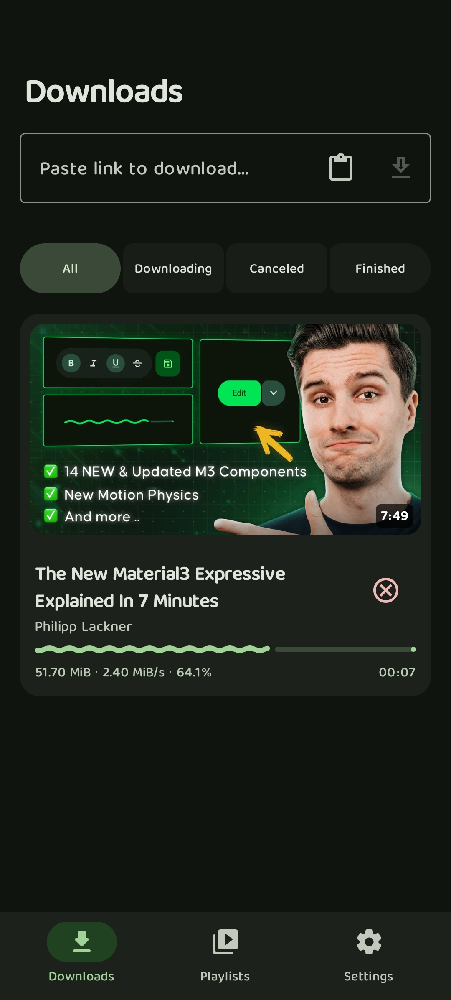</td>
    <td align="center">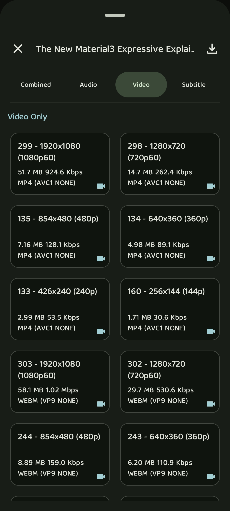</td>
    <td align="center">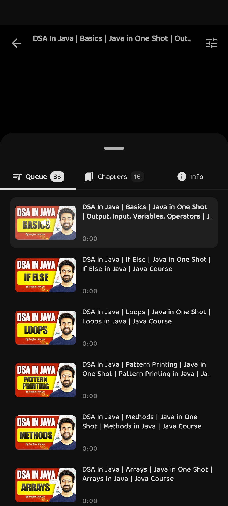</td>
  </tr>
</table>

<table>
  <tr>
    <th align="center">Playlists</th>
    <th align="center">Playlist Detail</th>
    <th align="center">Downloaded Videos</th>
  </tr>
  <tr>
    <td align="center">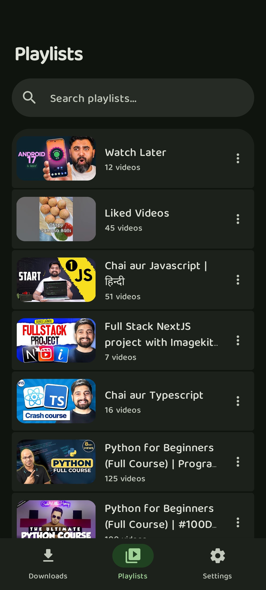</td>
    <td align="center">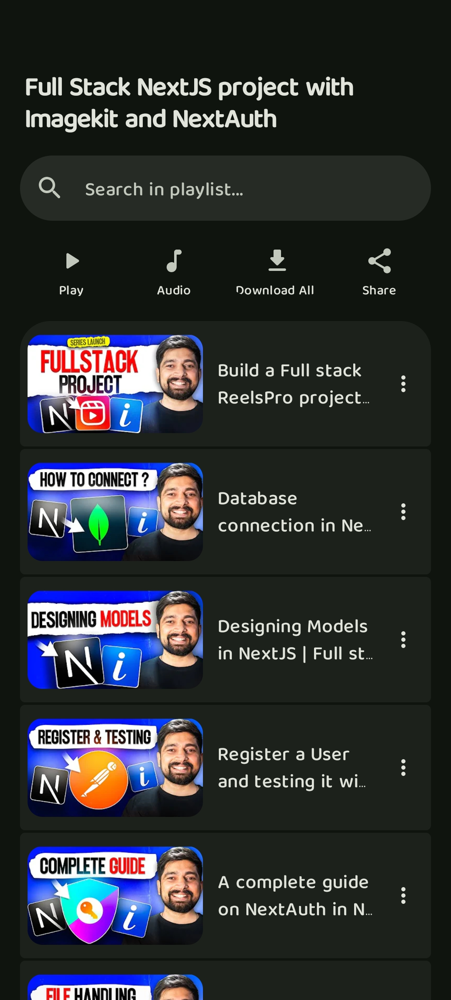</td>
    <td align="center">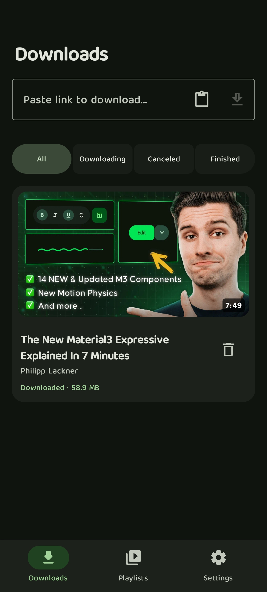</td>
  </tr>
</table>

<table>
  <tr>
    <th align="center">Player</th>
    <th align="center">Mini Player</th>
    <th align="center">Chapters</th>
  </tr>
  <tr>
    <td align="center">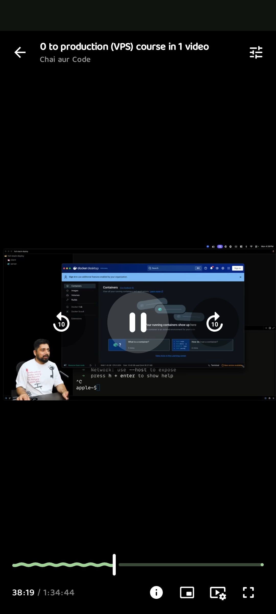</td>
    <td align="center">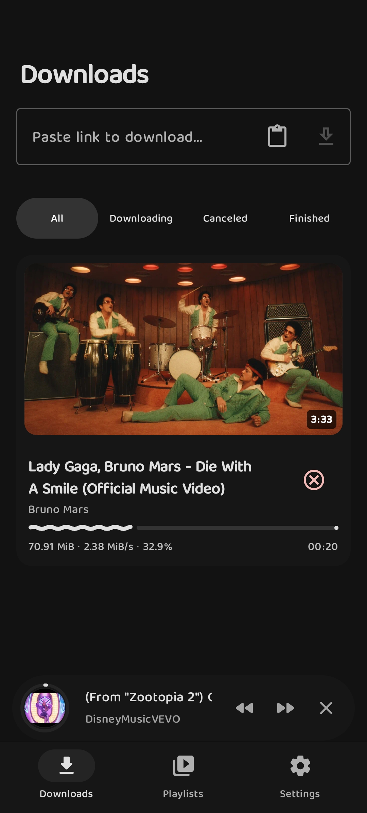</td>
    <td align="center">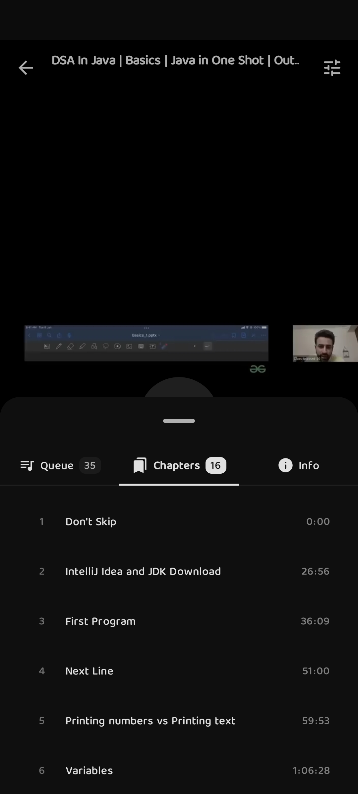</td>
  </tr>
</table>

<table>
  <tr>
    <th align="center">Settings</th>
    <th align="center">Playback Settings</th>
    <th align="center">Storage Settings</th>
  </tr>
  <tr>
    <td align="center">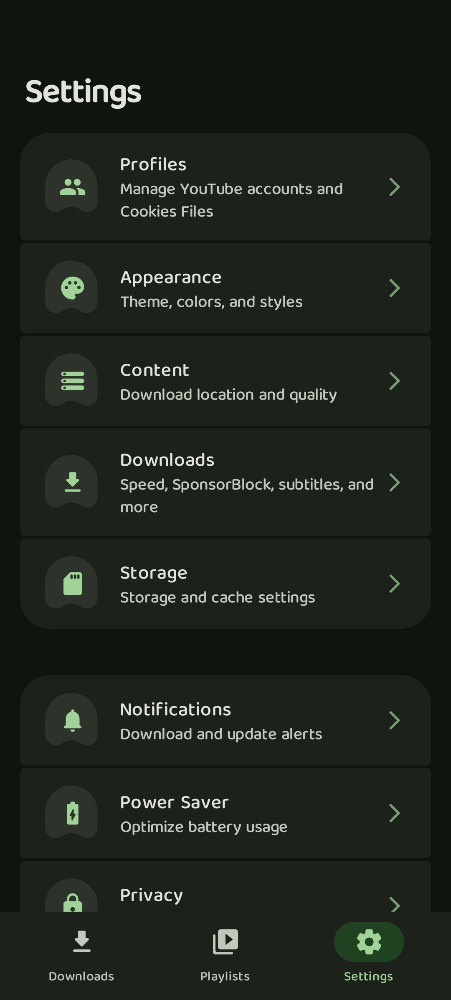</td>
    <td align="center">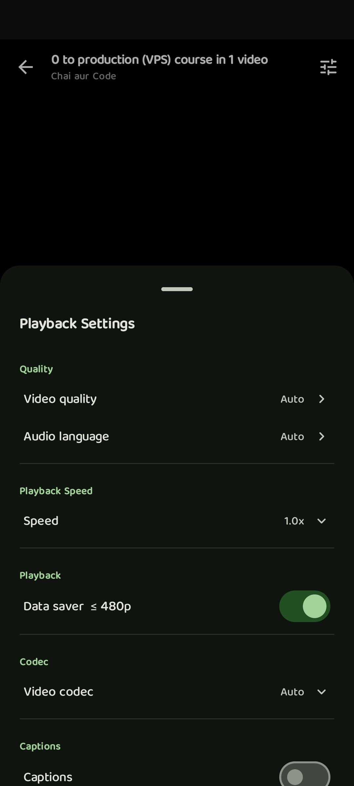</td>
    <td align="center">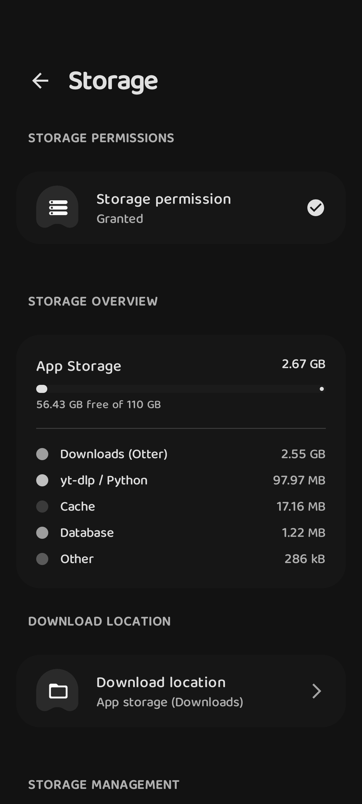</td>
  </tr>
</table>

---

## 🏗️ Architecture

```
┌─────────────────────────────────────────────────────────┐
│                      UI Layer                            │
│  (Jetpack Compose, Material3, ViewModels)               │
└────────────────────┬────────────────────────────────────┘
                     │
┌────────────────────▼────────────────────────────────────┐
│                    Domain Layer                          │
│  (Use Cases, Business Logic, Sync)                     │
└────────────────────┬────────────────────────────────────┘
                     │
┌────────────────────▼────────────────────────────────────┐
│                    Data Layer                            │
│  (Room Database, yt-dlp, NewPipe, DataStore)           │
└─────────────────────────────────────────────────────────┘
```

**Tech Stack:**
- **UI**: Jetpack Compose, Material Design 3
- **DI**: Hilt (Dagger)
- **Database**: Room
- **Async**: Kotlin Coroutines, Flow
- **Background**: WorkManager, Foreground Service
- **Media**: yt-dlp, NewPipe Extractor, Media3 ExoPlayer
- **Image Loading**: Coil 3

---

## 📋 Requirements

- Android 7.0 (API 24) or higher
- Android Studio Hedgehog (2023.1.1) or newer
- JDK 17
- ~100MB storage for app + downloads

---

## 🚀 Getting Started

### Clone & Build

```bash
# Clone the repository
git clone https://github.com/777abhishek/Otter.git
cd Otter

# Open in Android Studio
# Let Gradle sync complete

# Build debug APK
./gradlew assembleDebug
```

### Configure Signing (Release Builds)

1. Copy the example file:
   ```bash
   cp keystore.properties.example keystore.properties
   ```

2. Edit `keystore.properties` with your signing info:
   ```properties
   storeFile=path/to/your/keystore.jks
   storePassword=your_store_password
   keyAlias=your_key_alias
   keyPassword=your_key_password
   ```

3. Build release APK:
   ```bash
   ./gradlew assembleRelease
   ```

---

## 🔧 Configuration

### Environment Variables (Optional)

For backend integration, set these in `local.properties` or environment:

```properties
Otter_BACKEND_BASE_URL=https://your-backend.com
Otter_APP_API_KEY=your_api_key
```

---

## 📁 Project Structure

```
app/src/main/kotlin/com/Otter/app/
├── data/                    # Data layer
│   ├── auth/               # Cookie auth, profiles
│   ├── database/           # Room database, DAOs
│   ├── download/           # Download engine, queue
│   ├── models/             # Data models
│   ├── repositories/       # Data repositories
│   ├── sync/               # Playlist sync service
│   └── ytdlp/              # yt-dlp integration
├── di/                      # Hilt DI modules
├── network/                 # API services, telemetry
├── player/                  # Player service connection
├── service/                 # Foreground services
├── ui/                      # UI layer
│   ├── components/         # Reusable composables
│   ├── screens/            # Screen composables
│   ├── theme/              # Material3 theme
│   └── viewmodels/         # ViewModels
├── util/                    # Utilities
└── work/                    # WorkManager workers
```

---

## 🍪 Cookie Authentication

Otter supports authenticated downloads to access:
- Age-restricted videos
- Private playlists
- Watch Later / Liked Videos
- Member-only content

### Setup

1. Go to **Settings → Profiles**
2. Create a profile
3. Tap **Cookie Targets**
4. Connect via WebView or import `cookies.txt`
5. Toggle **Use** for yt-dlp operations

### Supported Sites
- YouTube
- Instagram
- Twitter/X
- Reddit
- **Custom websites** (add your own)

---

## 📖 Documentation

- [Architecture Guide](docs/architecture.md)
- [Contributing Guide](CONTRIBUTING.md)
- [Project Structure](app/src/main/kotlin/com/Otter/app/Structure.md)

---

## 🤝 Contributing

Contributions are welcome! Please read the [Contributing Guide](CONTRIBUTING.md) for details.

### Quick Steps

1. Fork the repo
2. Create a feature branch (`git checkout -b feature/amazing-feature`)
3. Commit changes (`git commit -m 'feat: add amazing feature'`)
4. Push to branch (`git push origin feature/amazing-feature`)
5. Open a Pull Request

### Code Style

We use KtLint and Detekt:

```bash
./gradlew ktlintCheck detekt
./gradlew ktlintFormat  # Auto-fix
```

---

## 📜 License

This project is licensed under the MIT License - see the [LICENSE](LICENSE) file for details.

---

## ⚠️ Disclaimer

This app is for personal, educational use only. Please respect copyright laws and terms of service of video platforms. The developers are not responsible for how this software is used.

**Note:** yt-dlp and NewPipe Extractor are separate projects with their own licenses. This app uses them as libraries/tools.

---

## 🙏 Acknowledgments

- [yt-dlp](https://github.com/yt-dlp/yt-dlp) - Video download engine
- [youtubedl-android](https://github/junkfood02/youtubedl-android)- Yt-DLP, ffmpeg Binary for android 
- [NewPipe Extractor](https://github.com/TeamNewPipe/NewPipeExtractor) - Stream extraction
- [ExoPlayer (Media3)](https://github.com/androidx/media) - Video playback
- [Coil](https://github.com/coil-kt/coil) - Image loading
- [Material Design 3](https://m3.material.io/) - UI design system

---

## 📞 Support

- **Bug Reports**: [Open an issue](https://github.com/777abhishek/Otter/issues)
- **Feature Requests**: [Open an issue](https://github.com/777abhishek/Otter/issues) with `enhancement` label
- **Questions**: Check existing issues or start a discussion

---

<div align="center">
  Made with love by <a href="https://github.com/777abhishek">777abhishek</a>
</div>
